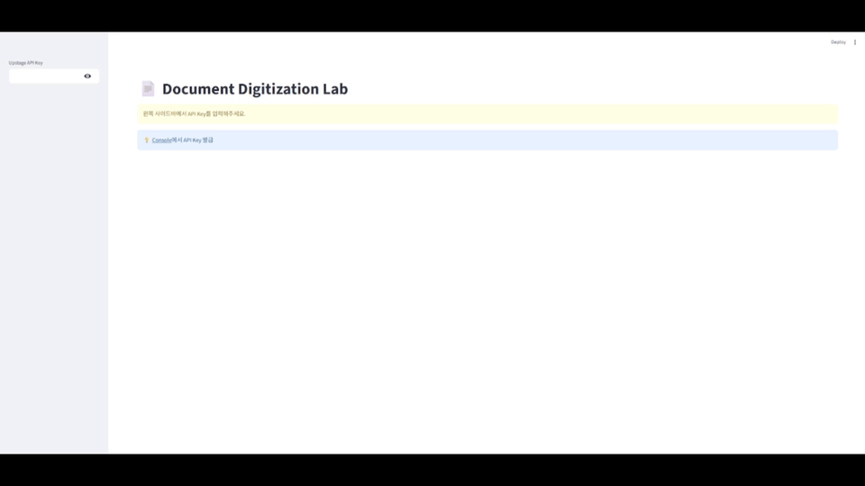

# 📄 Document Digitization Lab

Upstage Document AI의 **모든 기능**을 실시간으로 체험하는 인터랙티브 데모입니다.

> 💡 **이 앱을 만든 이유**: Document Parse와 OCR의 모든 파라미터를 직접 조작하고, 원본과 결과를 비교하기 위함입니다.

---

## 🚀 빠른 시작

```bash
# 1. 설치
pip install streamlit requests pdf2image pillow

# 2. 실행
streamlit run app.py

# 3. 브라우저에서 http://localhost:8501 열림
```

**API 키 발급**: [Upstage Console](https://console.upstage.ai/) → API Keys → 새 키 생성

---

## 📸 앱 구조


> 왼쪽: API 선택 및 설정 | 오른쪽: 원본과 결과 비교

---

## 🎓 실습 튜토리얼

### 📊 실습 1: 복잡한 재무제표 파싱 (삼성전자 사례)

**목표**: 병합된 셀과 계층 구조가 있는 재무제표를 정확하게 파싱

**준비물**: 삼성전자 분기 재무상태표 PDF (자본변동표)

1. **API 선택**: Document Parse
2. **기본 옵션**:
   - 출력: `markdown`
   - OCR: `auto` (디지털 PDF) 또는 `force` (스캔본)
   - 좌표: 체크
3. 삼성전자 재무제표 PDF 업로드
4. **실행** → 결과 확인

**파싱 결과**:

> Enhanced 모드가 복잡한 재무제표를 정확하게 파싱


**핵심 포인트**:
- ✅ 다단계 헤더 정확히 보존
- ✅ 계층 구조 (I., 1., 2.) 유지
- ✅ 숫자 데이터 정확히 추출
- ✅ 병합된 셀 처리

---

### 🔍 실습 2: OCR로 스캔 문서 텍스트 추출

**목표**: 이미지 기반 문서를 텍스트로 변환

1. **API 선택**: Document OCR
2. **옵션**:
   - 스키마: `None` (기본 Upstage 형식)
3. 스캔된 영수증/명함 이미지 업로드
4. **실행** → 텍스트 추출 확인

**입력**: 영수증 이미지
```
[이미지: 쇼핑 영수증]
```

> 스캔된 영수증에서 텍스트 자동 추출

---

### 🎨 실습 3: Base64 인코딩으로 요소 추출

**목표**: 문서에서 표/이미지를 이미지 파일로 추출

1. **API 선택**: Document Parse
2. **옵션**:
   - Base64 인코딩: 모두 선택
3. 표와 이미지가 포함된 문서 업로드
4. **실행** → JSON 다운로드
5. JSON에서 `base64_encoding` 으로 디코딩한 결과 확인


> 문서에서 선택한 카테고리를 Base64로 추출하는 과정

---

## 🎯 파라미터 치트시트

### Document Parse

| 파라미터 | 옵션 | 기본값 | 설명 |
|---------|------|--------|----------|
| **model** | document-parse, document-parse-nightly | - | document-parse: 최신 안정 버전<br>nightly: 최신 기능 테스트 |
| **output_formats** | text, html, markdown | ["html"] | markdown: RAG 최적<br>html: 구조 보존<br>text: 순수 텍스트 |
| **ocr** | auto, force | auto | auto: 이미지 문서만 OCR<br>force: 모든 문서 OCR |
| **coordinates** | true, false | true | true: 바운딩 박스 좌표 반환<br>false: 좌표 제외 |
| **base64_encoding** | table, figure, chart, heading1, header, footer, caption, paragraph, equation, list, index, footnote | [] | 선택한 카테고리를 원본 문서에서 잘라낸 이미지로 추출 |
| **mode** (Beta) | standard, enhanced, auto | standard | standard: 텍스트 중심, 단순 표<br>enhanced: 복잡한 표/차트/이미지<br>auto: 페이지별 자동 분류 |
| **chart_recognition** (Beta) | true, false | true | true: 차트→표 변환<br>enhanced 모드에선 항상 활성화 |
| **merge_multipage_tables** (Beta) | true, false | false | true: 다중 페이지 표 병합<br>enhanced+true일 때 20페이지 제한 |

### Document OCR

| 파라미터 | 옵션 | 기본값 | 설명 |
|---------|------|--------|----------|
| **model** | ocr | - | ocr: 최신 안정 버전 |
| **schema** | None, clova, google | None | None: Upstage 기본 형식<br>clova: Naver Clova OCR 호환<br>google: Google Vision API 호환 |

---

## 🤝 피드백

이슈나 개선 아이디어가 있다면 언제든 공유해주세요!
