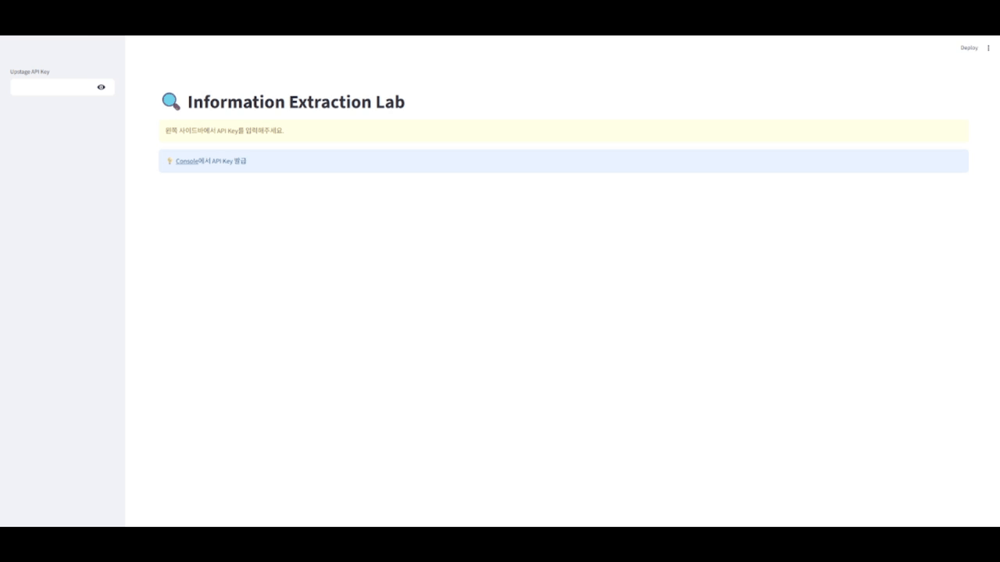
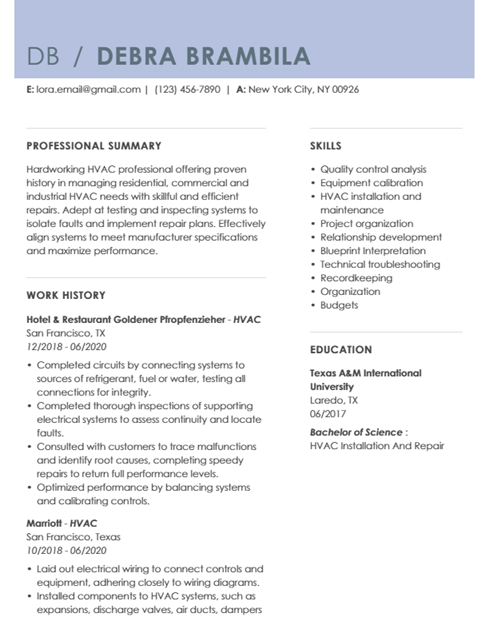
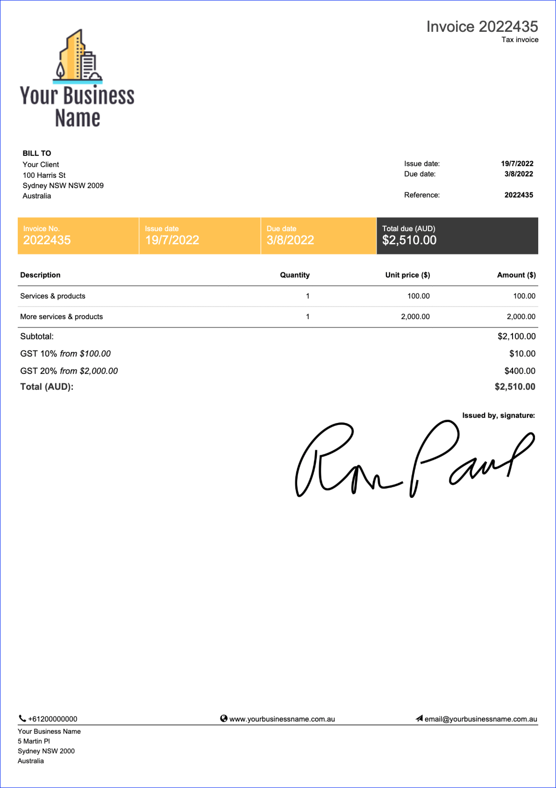
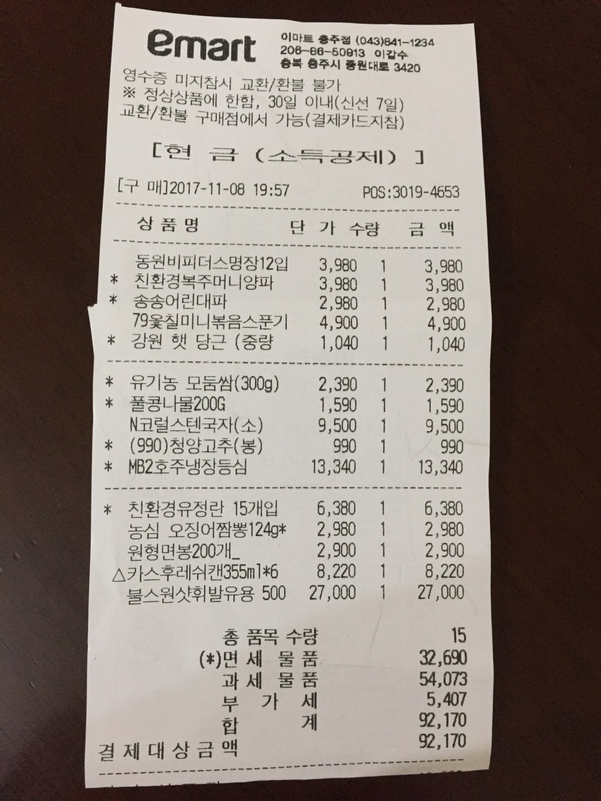
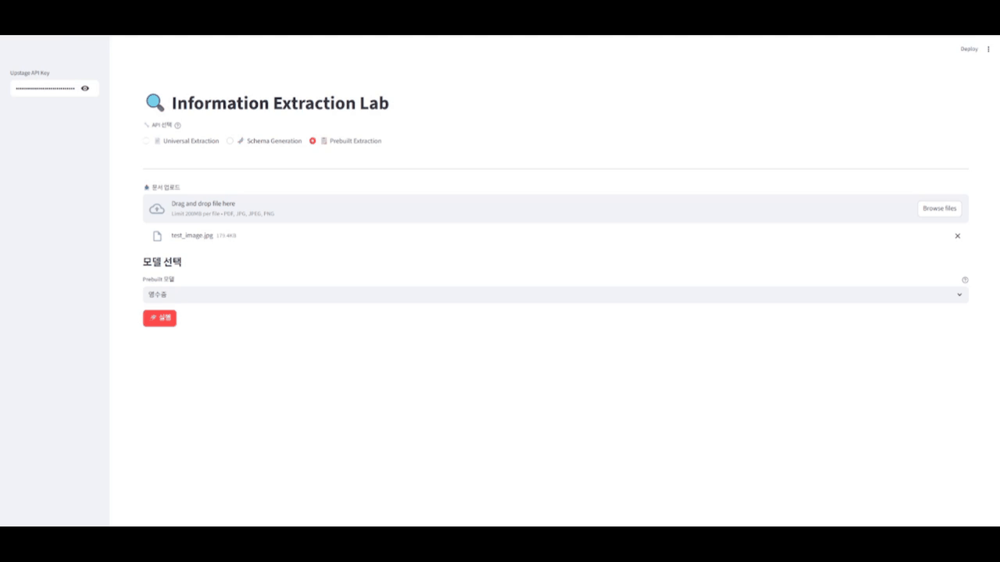
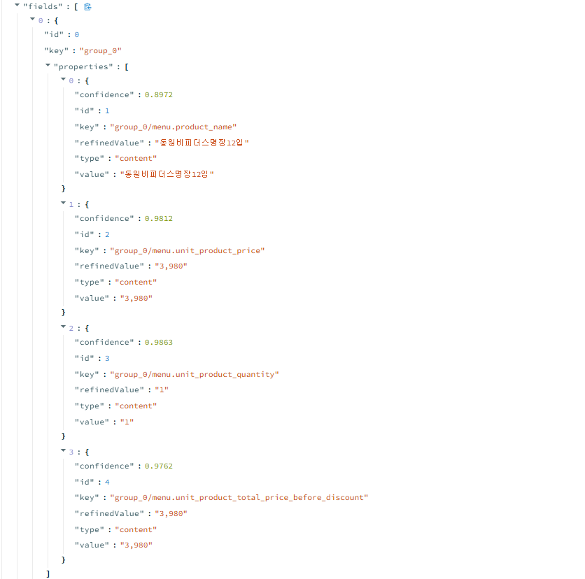

# 🔍 Information Extraction Lab

Upstage Information Extraction API의 **모든 기능**을 실시간으로 체험하는 인터랙티브 데모입니다.

> 💡 **이 앱을 만든 이유**: Universal, Schema Generation, Prebuilt 세 가지 추출 방식을 직접 비교하고, 실제 문서로 테스트하기 위함입니다.

---

## 🚀 빠른 시작

```bash
# 1. 설치
pip install streamlit requests

# 2. 실행
streamlit run app.py

# 3. 브라우저에서 http://localhost:8501 열림
```

**API 키 발급**: [Upstage Console](https://console.upstage.ai/) → API Keys → 새 키 생성

---

## 📸 앱 구조


> 왼쪽: API 선택 및 옵션 설정 | 오른쪽: 결과 JSON 출력

---

## 🎓 실습 튜토리얼

### 📄 실습 1: 이력서 자동 파싱 (Universal Extraction)

**목표**: 이력서에서 지원자 정보, 학력, 경력을 구조화된 JSON으로 추출

**준비물**: 이력서 PDF 또는 이미지

1. **API 선택**: Universal Extraction
2. **스키마 설정**: 기본 제공된 이력서 스키마 사용 (또는 커스터마이징)
3. **옵션**:
   - 모드: `standard` (일반 이력서) 또는 `enhanced` (손글씨/저품질)
   - 신뢰도: 체크 (추출 정확도 확인)
4. 이력서 파일 업로드
5. **실행** → JSON 결과 확인

**스키마 예시**:
```json
{
  "type": "object",
  "properties": {
    "name": {
      "type": "string",
      "description": "지원자 이름"
    },
    "email": {
      "type": "string",
      "description": "이메일 주소"
    },
    "phone": {
      "type": "string",
      "description": "전화번호"
    },
    "education": {
      "type": "array",
      "description": "학력 사항",
      "items": {
        "type": "object",
        "properties": {
          "school": {"type": "string"},
          "degree": {"type": "string"},
          "major": {"type": "string"},
          "graduation_date": {"type": "string"}
        }
      }
    },
    "experience": {
      "type": "array",
      "description": "경력 사항",
      "items": {
        "type": "object",
        "properties": {
          "company": {"type": "string"},
          "position": {"type": "string"},
          "period": {"type": "string"},
          "description": {"type": "string"}
        }
      }
    },
    "skills": {
      "type": "array",
      "description": "보유 기술",
      "items": {"type": "string"}
    }
  },
  "required": ["name"]
}
```


> 원본 이력서

**파싱 결과**:

> 이력서에서 구조화된 JSON 데이터 자동 추출

**추출된 JSON**:
```json
{
  "name": "DEBRA BRAMBILA",
  "email": "lora.email@gmail.com",
  "phone": "(123) 456-7890",
  "education": [
    {
      "school": "Texas A&M International University",
      "degree": "Bachelor of Science",
      "major": "HVAC Installation And Repair",
      "graduation_date": "06/2017"
    }
  ],
  "experience": [
    {
      "company": "Hotel & Restaurant Goldener Pfropfenzieher",
      "position": "HVAC",
      "period": "12/2018 06/2020",
      "description": "· Completed circuits by connecting systems to sources of refrigerant, fuel or water, testing all connections for integrity.\n· Completed thorough inspections of supporting electrical systems to assess continuity and locate faults.\n· Consulted with customers to trace malfunctions and identify root causes, completing speedy repairs to return full performance levels.\n· Optimized performance by balancing systems and calibrating controls."
    },
    {
      "company": "Marriott",
      "position": "HVAC",
      "period": "10/2018 06/2020",
      "description": "· Laid out electrical wiring to connect controls and equipment, adhering closely to wiring diagrams.\n· Installed components to HVAC systems, such as expansions, discharge valves, air ducts, dampers"
    }
  ],
  "skills": [
    "Quality control analysis",
    "Equipment calibration",
    "HVAC installation and maintenance",
    "Project organization",
    "Relationship development",
    "Blueprint Interpretation",
    "Technical troubleshooting",
    "Recordkeeping",
    "Organization",
    "Budgets"
  ]
}
```

**핵심 포인트**:
- ✅ 제로샷 학습으로 학습 데이터 없이 추출
- ✅ 배열 구조로 여러 학력/경력 자동 인식
- ✅ 신뢰도 정보로 검증 필요 항목 파악

**활용 시나리오**:
- 채용 시스템 자동화
- 지원자 DB 구축
- 이력서 스크리닝

---

### 🧬 실습 2: 송장 스키마 자동 생성 (Schema Generation)

**목표**: 처음 보는 송장 문서의 추출 스키마를 AI가 자동 설계

**준비물**: 송장(Invoice) 문서

1. **API 선택**: Schema Generation
2. **추출 목표 입력**:
   ```
   Generate schema to extract invoice number, issue date, due date, 
   vendor information (name, address, tax ID), line items (description, 
   quantity, unit price, total), subtotal, tax amount, and total amount.
   ```
3. 송장 문서 업로드
4. **실행** → 생성된 스키마 확인
5. 생성된 스키마를 복사하여 Universal Extraction에서 실제 추출


> 송장 문서 예시


> AI가 문서를 분석하여 최적의 스키마 자동 생성

**생성 스키마 예시**:
```json
{
   "type":"json_schema",
   "json_schema":{
      "name":"document_schema",
      "schema":{
         "type":"object",
         "properties":{
            "invoice_number":{
               "type":"string",
               "description":"Unique identifier assigned to the invoice for tracking and reference purposes."
            },
            "issue_date":{
               "type":"string",
               "description":"The date on which the invoice was created and issued to the client."
            },
            "due_date":{
               "type":"string",
               "description":"The date by which the payment for the invoice is expected to be made."
            },
            "vendor_name":{
               "type":"string",
               "description":"The name of the business or entity issuing the invoice."
            },
            "vendor_address":{
               "type":"string",
               "description":"The physical address of the vendor including street, city, state, and country."
            },
            "line_items":{
               "type":"array",
               "items":{
                  "type":"object",
                  "properties":{
                     "description":{
                        "type":"string",
                        "description":"A brief explanation or name of the product or service provided."
                     },
                     "quantity":{
                        "type":"number",
                        "description":"The amount or number of units of the product or service provided."
                     },
                     "unit_price":{
                        "type":"number",
                        "description":"The cost per single unit of the product or service."
                     },
                     "total":{
                        "type":"number",
                        "description":"The total cost for the line item, calculated as quantity multiplied by unit price."
                     }
                  }
               }
            },
            "subtotal":{
               "type":"number",
               "description":"The total amount before taxes and additional charges are applied."
            },
            "tax_amount":{
               "type":"number",
               "description":"The total amount of tax applied to the invoice."
            },
            "total_amount":{
               "type":"number",
               "description":"The final total amount due including subtotal and all taxes."
            }
         }
      }
   }
}
```

**핵심 포인트**:
- ✅ 도메인 지식 없이 빠른 스키마 설계
- ✅ 문서 구조를 AI가 자동 분석
- ✅ 프로토타이핑 시간 단축

**활용 시나리오**:
- 신규 문서 타입 POC
- 스키마 설계 자동화
- 비개발자도 쉽게 시작

---

### 📋 실습 3: 영수증 정보 추출 (Prebuilt Extraction)

**목표**: 영수증에서 상호명, 금액, 날짜를 높은 정확도로 추출

**준비물**: 영수증 이미지

1. **API 선택**: Prebuilt Extraction
2. **모델 선택**: `receipt-extraction` (영수증)
3. 영수증 이미지 업로드
4. **실행** → 구조화된 데이터 확인


> 영수증 예시

**추출 결과 예시**:


> Prebuilt 모델로 영수증 정보 즉시 추출

**핵심 포인트**:
- ✅ 특화 모델로 최고 정확도
- ✅ 스키마 정의 불필요
- ✅ 즉시 사용 가능

**활용 시나리오**:
- 회계 시스템 연동
- 영수증 관리 앱

---

## 🎯 파라미터 치트시트

### Universal Extraction

| 파라미터 | 옵션 | 기본값 | 설명 |
|---------|------|--------|------|
| **model** | information-extract | - | 최신 안정 버전 (필수) |
| **messages** | array | - | 이미지 포함 메시지 배열 (필수) |
| **response_format** | object | - | JSON 스키마 정의 (필수) |
| **mode** (Beta) | standard, enhanced | standard | standard: 일반 문서<br>enhanced: 복잡한 표/저품질/손글씨 (추가 비용) |
| **location** (Beta) | true, false | false | true: 페이지 번호 + 바운딩 박스 좌표 (0~1 정규화)<br>false: 위치 정보 제외 |
| **location_granularity** (Beta) | element, word, all | element | element: HTML 요소 전체 좌표<br>word: 특정 단어 좌표<br>all: 둘 다 |
| **split** (Beta) | true, false | false | true: 단일 파일 내 여러 문서 자동 분할<br>false: 단일 문서로 처리 |
| **confidence** (Beta) | true, false | false | true: 신뢰도(high/low) 반환<br>재현율 >95%, low 중 약 50%가 오추출 |
| **chunking** (Beta) | object | - | `{"pages_per_chunk": 5}`<br>30페이지 이상 또는 50행 이상 표에 권장 |

### Schema Generation

| 파라미터 | 옵션 | 기본값 | 설명 |
|---------|------|--------|------|
| **model** | information-extract | - | 최신 안정 버전 (필수) |
| **messages** | array | - | system: 추출 목표<br>user: 이미지 (최대 3개) |

### Prebuilt Extraction

| 파라미터 | 옵션 | 기본값 | 설명 |
|---------|------|--------|------|
| **model** | receipt-extraction<br>air-waybill-extraction<br>bill-of-lading-and-shipping-request-extraction<br>commercial-invoice-and-packing-list-extraction<br>kr-export-declaration-certificate-extraction | - | 영수증<br>항공화물운송장<br>선하증권/선적요청서<br>상업송장/포장명세서<br>수출신고필증 |
| **document** | file | - | 문서 파일 (필수) |

---

## 🤝 피드백

이슈나 개선 아이디어가 있다면 언제든 공유해주세요!
