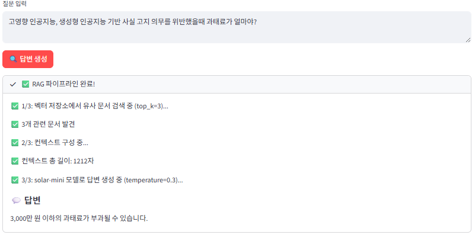
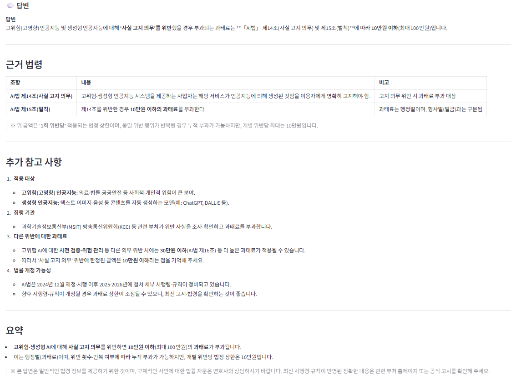

# 🧮 Embeddings & RAG Pipeline Lab

Upstage Embeddings API를 활용한 **RAG(Retrieval-Augmented Generation)** 시스템을 실시간으로 체험하는 인터랙티브 데모입니다.

> 💡 **이 앱을 만든 이유**: 01_chat_completions (ChatUpstage) + 02_document_digitization (Document Parse) + Embeddings를 결합하여 실전 RAG 파이프라인을 구축하고, Vector DB 내부를 투명하게 확인하기 위함입니다.

---

## 🚀 빠른 시작

```bash
# 1. 설치
pip install streamlit langchain-upstage langchain-chroma langchain-community chromadb numpy requests

# 2. 실행
streamlit run app.py

# 3. 브라우저에서 http://localhost:8501 열림
```

**API 키 발급**: [Upstage Console](https://console.upstage.ai/) → API Keys → 새 키 생성

---

## 📸 앱 구조

### 📚 RAG Pipeline (탭 1)
문서 업로드 → Document Parse API → 텍스트 분할 → 임베딩 → 벡터 저장 → 질문 검색 → LangChain ChatUpstage 답변 생성

### 💬 일반 LLM (탭 2)
문서 없이 LangChain ChatUpstage로 직접 대화 (RAG 비교용)

### 🗄️ Vector DB 내부 (탭 3)
저장된 청크 확인 → 메타데이터 조회 → 벡터 유사도 테스트

---

## 🔧 기술 스택

| 컴포넌트 | 구현 방식 | 설명 |
|---------|----------|------|
| **Document Parse** | 직접 API 호출 (requests) | LangChain 래퍼 없음 |
| **ChatUpstage** | LangChain | 스트리밍, 에러 핸들링 자동화 |
| **UpstageEmbeddings** | LangChain | 벡터화 및 유사도 검색 |
| **Chroma** | LangChain | 로컬 벡터 DB |
| **TextSplitter** | LangChain | 청크 분할 |

---

## 🎓 실습 튜토리얼

### 📄 실습 1: 문서 기반 질의응답 (RAG Pipeline - 탭 1)

**목표**: AI 기본법 PDF를 업로드하고 과태료 관련 질문에 정확한 답변 받기

**준비물**: `sample-data/ai_기본법.pdf` (AI 기본법 관련 문서)

**사용 기술**: Document Parse API (직접 호출) + LangChain (ChatUpstage, Embeddings, Chroma)

**실습 시나리오**: 
```
질문: "고영향 인공지능, 생성형 인공지능 기반 사실 고지 의무를 위반했을 때 과태료가 얼마야?"
```

**단계:**

1. **문서 업로드 & 파싱**
   - 왼쪽에서 `ai_기본법.pdf` 선택
   - 청크 크기: 500, 오버랩: 100 (기본값)
   - Document Parse 옵션:
     - 출력 형식: `markdown` (RAG 최적)
     - 모드: `auto`
     - OCR: `auto`
   - "📄 문서 파싱 & 임베딩" 클릭
   - 처리 과정 확인:
     - ✅ Document Parse API로 법률 문서 구조 분석
     - ✅ RecursiveCharacterTextSplitter로 청크 분할
     - ✅ UpstageEmbeddings로 벡터화
     - ✅ Chroma 벡터 저장소에 저장


> AI 기본법 PDF를 파싱하고 벡터 저장소에 저장하는 과정

2. **질문 & 답변 생성**
   - 오른쪽에서 모델 선택: `solar-mini`
   - Temperature: `0.3` (정확한 답변)
   - 검색할 문서 수: `3`
   - 질문 입력:
     ```
     고영향 인공지능, 생성형 인공지능 기반 사실 고지 의무를 위반했을 때 과태료가 얼마야?
     ```
   - "🔍 답변 생성" 클릭



> 벡터 검색으로 관련 조항을 찾고 정확한 과태료 금액 답변

3. **결과 확인**
   - 검색된 관련 문서 3개 확인 (유사도 점수 포함)
   - ChatUpstage가 생성한 답변:
     ```
     3,000만 원 이하의 과태료가 부과될 수 있습니다.
     ```
   - 검색된 문서에서 근거 조항 확인 가능

**핵심 포인트:**
- ✅ Document Parse로 문서 구조 보존
- ✅ 임베딩으로 의미 기반 검색
- ✅ ChatUpstage로 자연스러운 답변 생성
- ✅ 코사인 유사도로 관련성 측정 (높을수록 유사)

**활용 시나리오:**
- 사내 문서 검색 시스템
- 고객 지원 챗봇
- 법률/의료 문서 분석

---

### 💬 실습 2: 일반 LLM vs RAG 비교 (탭 2)

**목표**: 같은 질문을 문서 없이 물어보고 RAG와 답변 차이 비교

**사용 기술**: LangChain ChatUpstage (스트리밍)

**단계:**

1. **일반 LLM 탭에서 질문**
   - 모델: `solar-mini`
   - Temperature: `0.3`
   - 같은 질문 입력:
     ```
     고영향 인공지능, 생성형 인공지능 기반 사실 고지 의무를 위반했을 때 과태료가 얼마야?
     ```
   - "💬 답변 생성" 클릭



> 문서 없이 사전 지식만으로 답변 (부정확하거나 모른다고 답변 가능)

2. **결과 비교**
   - **일반 LLM**: 사전 지식 기반 → 최신 법률 정보 없음, 부정확
   - **RAG (탭 1)**: 문서 기반 → 정확한 정보 제시
   - 💡 RAG의 필요성 체감!

**핵심 차이점**:
| 구분 | 일반 LLM | RAG |
|------|----------|-----|
| **정보 출처** | 사전 학습 지식 | 업로드한 문서 |
| **최신성** | 학습 시점까지 | 실시간 문서 반영 |
| **정확도** | 낮음 (추측 가능) | 높음 (문서 근거) |
| **근거 제시** | 불가능 | 검색된 문서 확인 가능 |

**핵심 포인트:**
- ✅ 같은 질문, 다른 결과로 RAG 효과 명확히 비교
- ✅ 법률/의료/기술 문서 등 전문 분야에서 RAG 필수

**활용 시나리오:**
- 법률 문서 검색 시스템
- 사내 규정/매뉴얼 챗봇
- 기술 문서 Q&A

---

### 🗄️ 실습 3: Vector DB 내부 들여다보기 (탭 3)

**목표**: Chroma 벡터 저장소에 저장된 데이터 확인 및 직접 검색

**단계:**

1. **통계 확인**
   - 원본 페이지 수
   - 청크 수
   - 벡터 차원

2. **저장된 청크 확인**
   - 모든 청크의 전체 내용 확인
   - 메타데이터 조회 (페이지 번호 등)

3. **벡터 유사도 테스트**
   - 임의의 쿼리 입력
   - 검색할 청크 수 설정
   - 벡터 검색 실행
   - 유사도 점수와 함께 결과 확인

**핵심 포인트:**
- ✅ 벡터 저장소 내부 투명하게 확인
- ✅ 청크 분할 결과 검증
- ✅ 유사도 검색 동작 이해

---

## 🔗 RAG Pipeline 흐름도

```
📄 문서 업로드
    ↓
📋 Document Parse API (직접 호출 - requests)
    ↓
✂️ 텍스트 분할 (LangChain RecursiveCharacterTextSplitter)
    ↓
🧮 임베딩 (LangChain UpstageEmbeddings)
    ↓
💾 벡터 저장 (LangChain Chroma - 코사인 유사도)
    ↓
❓ 질문 입력
    ↓
🔍 유사 문서 검색 (코사인 유사도 높은 순)
    ↓
💬 답변 생성 (LangChain ChatUpstage - 스트리밍)
```

### 일반 LLM 흐름도

```
❓ 질문 입력
    ↓
💬 답변 생성 (LangChain ChatUpstage - 스트리밍)
```

---

## 💡 Tips

### RAG vs 일반 LLM 비교
- **RAG (탭 1)**: 문서 기반 정확한 답변, 최신 정보 반영 가능
- **일반 LLM (탭 2)**: 사전 지식 기반, 문서 내용 모름
- **추천**: 문서 관련 질문은 RAG, 일반 지식은 LLM

### RAG 성능 향상
- **청크 크기**: 너무 작으면 컨텍스트 부족, 너무 크면 노이즈 증가
- **top_k**: 관련 문서가 많으면 늘리고, 정확도가 중요하면 줄이기
- **Temperature**: 사실 기반 답변은 낮게 (0.1-0.3), 창의적 답변은 높게 (0.7-1.0)

### 임베딩 모델 선택
- **embedding-query**: 검색 쿼리, 짧은 텍스트
- **embedding-passage**: 긴 문서, 저장용

### 청킹 전략
- **RecursiveCharacterTextSplitter**: 문단 → 문장 → 단어 순으로 재귀적 분할
- chunk_size는 목표 크기이며, 실제로는 자연스러운 경계에서 분할
- 대부분 400~600자 범위로 가변적, 컨텍스트는 보존됨

### Vector DB 이해
- **Chroma**: 로컬 인메모리 벡터 DB (프로토타입용)
- **코사인 유사도**: 0~1 범위, 높을수록 유사

---

## 🤝 피드백

이슈나 개선 아이디어가 있다면 언제든 공유해주세요!
